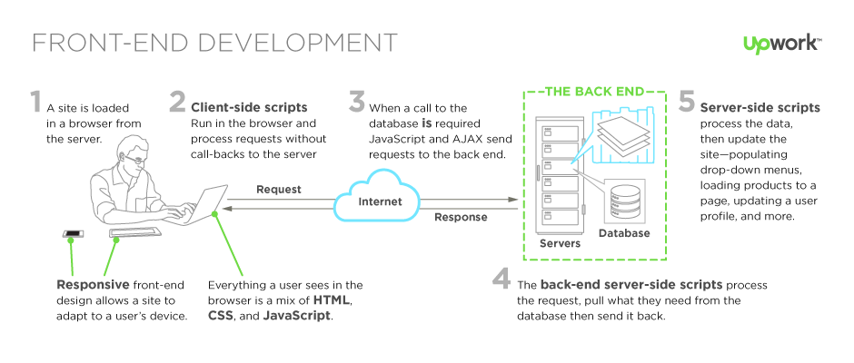
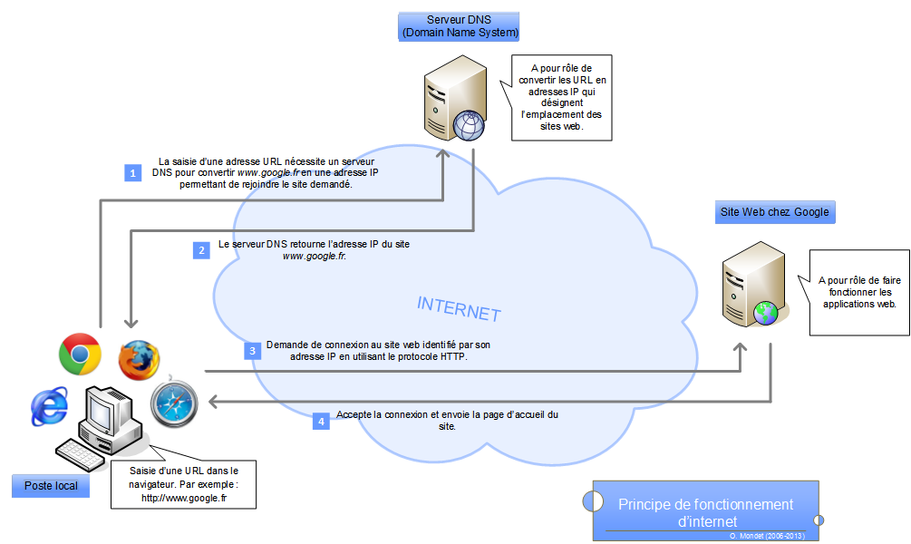

# Le web : client / server

## Qui fait quoi ?

## Le navigateur

Le navigateur est un intermediaire entre l'utilisateur au même titre que n'importe quel logiciel ou app desktop ou mobile

### les différents type de donnée

* html
* css
* javascript
* police de lettre
* emoticon
* video
* son
* svg
* bitmap (pixel) via canvas
* webgl
* json
* xml
* ...

[En fait, c'est un peu plus compliqué que ça](https://platform.html5.org/)

### Les moteurs principaux

* Moteur html
* Moteur css
* Moteur js

### Des lecteur http partout

in software, in app mobile, in IOT, ...

### Comment sont transmise ces données au navigateur

Les protocoles principaux sont :

* le protocole HTTP
* le protocole HTTPS

Mais il en existe beaucoup :

* Web socket
* WebRTC
* RTSP, RTMP, HTTP, HLS, IGMP (streaming video)
* ...

## Le server

Une machine avec des services

## DNS : Domain names et IP adresses

## HTTPS : certicat SSL et autorité de certification

